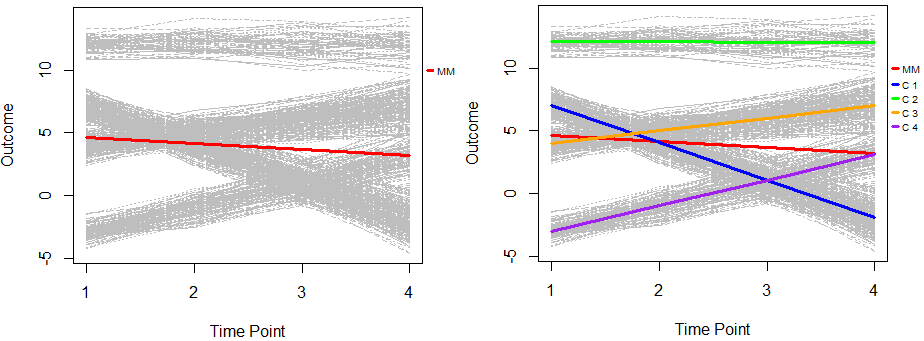

#### O projeto realiza análises exploratórias de trajetórias longitudinais, comparando Modelos de Efeitos Mistos e abordagens baseadas em grupos latentes. Destacam-se os Modelos de Mistura de Crescimento (GMM) e a Análise de Crescimento com Classes Latentes (LCGA), aplicados a dados de mortalidade infantil em cidades brasileiras (2005–2012) disponibilizados por Russo (2019). Disponível em: [openICPSR](https://www.openicpsr.org/openicpsr/project/108527/version/V1/view;jsessionid=81B73ADAB523CB4E00C486CA530208E6?path=/openicpsr/108527/fcr:versions/V1/Data_Final.dta&type=file).

   
  Figura 1: Trajetórias de crescimento de classes latentes. À esquerda estão todas as trajetórias ajustadas com um Modelo de Efeitos Mistos, e à direita o ajuste considerando quatro classes latentes usando metodologias LCGA/GMM. 

#### Os Municípios serão filtrados de acordo com o Coeficiente Geral de Mortalidade Padronizado por Idade (CGMP) por mil habitantes, no qual é calculado segundo a seguinte relação: 

$$
CGMP = \frac{\sum_i \left(\frac{O_i}{N_i}\times P_i\right)}{\sum_i P_i} \times 1000
$$

##### Onde:  
- $O_i$: número de óbitos no grupo etário $i$  
- $N_i$: população do grupo etário $i$  
- $P_i$: população padrão do grupo etário $i$  

#### O filtro utilizado será CGMP > 5 no primeiro triênio.

#### O Municípios também serão filtrados de acordo com o Desvio Médio Relativo do Número de Óbitos (DMRO), no qual é calculado segundo a seguinte relação: 

O **Desvio da Média de Óbitos (DMRO)** é definido como:  

$$
DMRO = \frac{DMO}{M} \times 100\%
$$  

onde:  

$$
DMO = \frac{|O_{t-1} - M| + |O_{t} - M| + |O_{t+1} - M|}{3}
$$  

$$
M = \frac{O_{t-1} + O_{t} + O_{t+1}}{3}
$$  

- $O_t$: número de óbitos no ano $t$.
- $M$: média do número de óbitos do triênio.

#### O filtro utilizado será DMRO < 20% no primeiro triênio.
### Referências
Russo, Letícia Xander. Data_IM_Brazil_Final: Data_Final.dta. Ann Arbor, MI: Inter-university Consortium for Political and Social Research [distributor], 2019-02-18. https://doi.org/10.3886/E108527V1-11941
