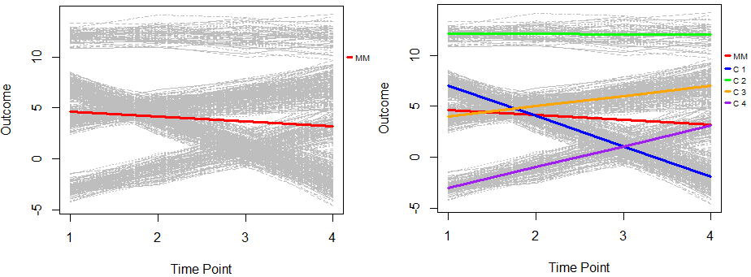

##### O presente tem como objetivo analisar o comportamento de taxas de mortalidade infantil em municípios brasileiros. Os dados utilizados abrangem o período entre 2005 e 2012 e foram disponibilizados por RUSSO (2019), estando acessíveis na plataforma [openICPSR](https://www.openicpsr.org/openicpsr/project/108527/version/V1/view;jsessionid=81B73ADAB523CB4E00C486CA530208E6?path=/openicpsr/108527/fcr:versions/V1/Data_Final.dta&type=file). No entanto, buscando assegurar a qualidade da informação, AQUINO, OLIVEIRA e BARRETO (2007) e FRIAS, SZWARCWALD e LIRA(2014) sugerem correções metodológicas que buscam estabelecer indicadores adequados para a mensuração de estatísticas vitais. Entre os indicadores utilizados, estão o Coeficiente Geral de Mortalidade Padronizado por Idade (CGMP) por mil habitantes e o Desvio Médio Relativo do Número de Óbitos (DMRO). O **CGMP** é calculado segundo a seguinte relação: 

$$
CGMP = \frac{\sum_i \left(\frac{O_i}{N_i}\times P_i\right)}{\sum_i P_i} \times 1000
$$

###### Onde:  
- $O_i$: número de óbitos no grupo etário $i$  
- $N_i$: população do grupo etário $i$  
- $P_i$: população padrão do grupo etário $i$  

##### O filtro utilizado foi de CGMP > 5 no primeiro triênio. O **Desvio da Média de Óbitos (DMRO)** é definido como:  

$$
DMRO = \frac{DMO}{M} \times 100\%
$$  

##### onde:  

$$
DMO = \frac{|O_{t-1} - M| + |O_{t} - M| + |O_{t+1} - M|}{3}
$$  

$$
M = \frac{O_{t-1} + O_{t} + O_{t+1}}{3}
$$  

- $O_t$: número de óbitos no ano $t$.
- $M$: média do número de óbitos do triênio.

##### O filtro utilizado foi de DMRO < 20% no primeiro triênio. Além dos indicadores já citados, também foram excluídos municípios com mortalidade infantil igual a 0. Os dados necessários para o cálculo do **DMRO** e **CGMP** foram retirados da plataforma [DATASUS](https://datasus.saude.gov.br/mortalidade-desde-1996-pela-cid-10). Unindo os filtros, obtemos um total de 1362 municípios.

   
  Figura 1: Trajetórias de crescimento de classes latentes. À esquerda estão todas as trajetórias ajustadas com um Modelo de Efeitos Mistos, e à direita o ajuste considerando quatro classes latentes usando metodologias LCGA/GMM. 

#### Referências

Aquino R, de Oliveira NF, Barreto ML. Impact of the family health program on infant mortality in Brazilian municipalities. Am J Public Health. 2009 Jan;99(1):87-93. doi: 10.2105/AJPH.2007.127480. Epub 2008 Nov 13. PMID: 19008516; PMCID: PMC2636620.

FRIAS, P. G.; SZWARCWALD, C.; LIRA, P. Avaliação dos sistemas de informações sobre nascidos vivos e
óbitos no brasil na década de 2000. Cad. Saúde Pública, v. 30, n. 10, p. 2068–2080, 2014.

Russo, Letícia Xander. Data_IM_Brazil_Final: Data_Final.dta. Ann Arbor, MI: Inter-university Consortium for Political and Social Research [distributor], 2019-02-18. https://doi.org/10.3886/E108527V1-11941

